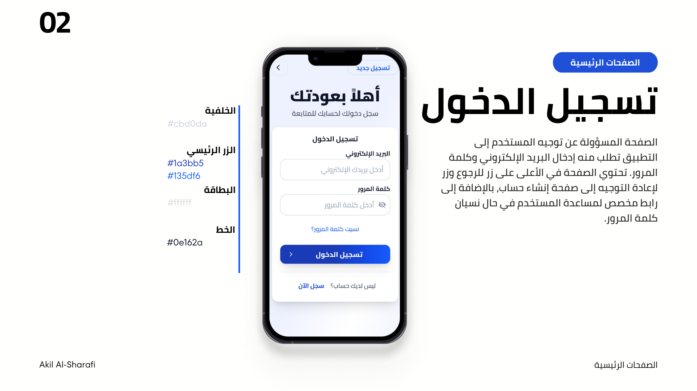

# تطبيق متجر الهواتف المحمولة


## معلومات الطالب
- **الاسم:** عقيل عبده الشرفي
- **المشروع:** تطبيق متجر باستخدام Flutter

## وصف المشروع
هذا تطبيق متجر للهواتف المحمولة مبني باستخدام إطار عمل Flutter. يوفر التطبيق واجهة مستخدم حديثة وسهلة الاستخدام لعرض وشراء المنتجات.

## الصفحات الموجودة في التطبيق

### 1. الصفحة الترحيب (Home Screen)
- الصفحة الرئيسية للتطبيق
- تعريف باسم التطبيق
- ازرار تنقل بين انشاء و تسجيل الدخول

### 2. صفحة تسجيل الدخول (Login Screen)
- واجهة تسجيل الدخول للمستخدمين
- حقول إدخال البريد الإلكتروني وكلمة المرور
- زر تسجيل الدخول
- رابط للانتقال إلى صفحة إنشاء حساب جديد
- رابط لاستعادة كلمة المرور

### 3. صفحة إنشاء حساب جديد (Signup Screen)
- نموذج إنشاء حساب جديد
- حقول إدخال البيانات الشخصية
- التحقق من صحة البيانات المدخلة
- زر إنشاء الحساب
- رابط للعودة إلى صفحة تسجيل الدخول

### 4. صفحة نسيان كلمة المرور (Forgot Password Screen)
- نموذج استعادة كلمة المرور
- حقل إدخال البريد الإلكتروني
- زر إرسال رابط إعادة تعيين كلمة المرور
- رابط للعودة إلى صفحة تسجيل الدخول

## التقنيات المستخدمة
- **Flutter:** إطار عمل التطوير
- **Dart:** لغة البرمجة
- **Material Design:** تصميم واجهة المستخدم

## هيكل المشروع
```
lib/
├── constants/          # الثوابت (الألوان، الأحجام، الأنماط)
├── models/            # نماذج البيانات
├── routes/            # مسارات التطبيق
├── screens/           # شاشات التطبيق
│   ├── auth/         # شاشات المصادقة
│   └── home_screen.dart
├── services/          # الخدمات
├── utils/            # الأدوات المساعدة
└── widgets/          # العناصر القابلة لإعادة الاستخدام
    ├── buttons/      # الأزرار
    ├── cards/        # البطاقات
    ├── common/       # العناصر المشتركة
    ├── forms/        # النماذج
    └── text/         # عناصر النصوص
```

## كيفية تشغيل المشروع
1. تأكد من تثبيت Flutter على جهازك
2. قم بتشغيل `flutter pub get` لتثبيت التبعيات
3. قم بتشغيل `flutter run` لتشغيل التطبيق

## المطور
تم تطوير هذا التطبيق بواسطة **عقيل عبده الشرفي** كجزء من مشروع تعليمي باستخدام Flutter.

## صور المشروع





